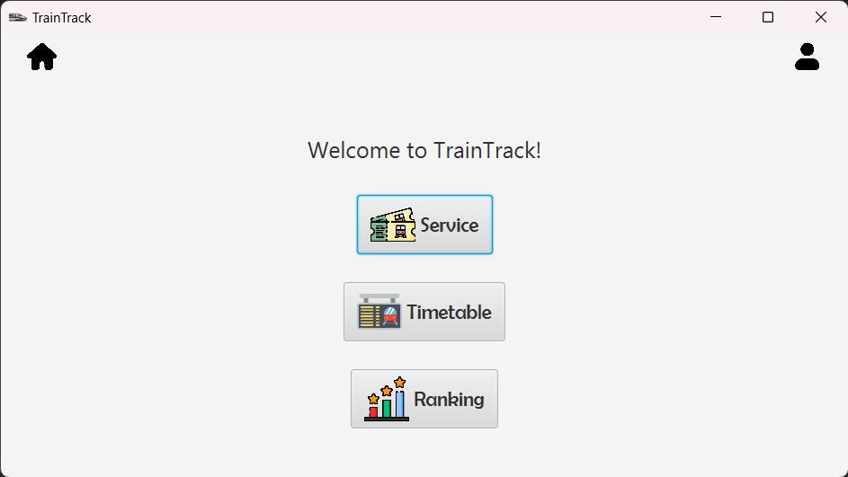
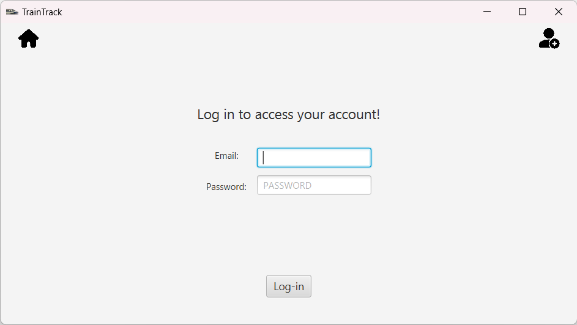
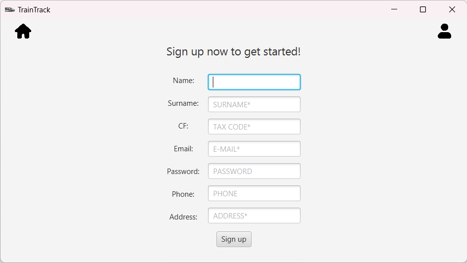
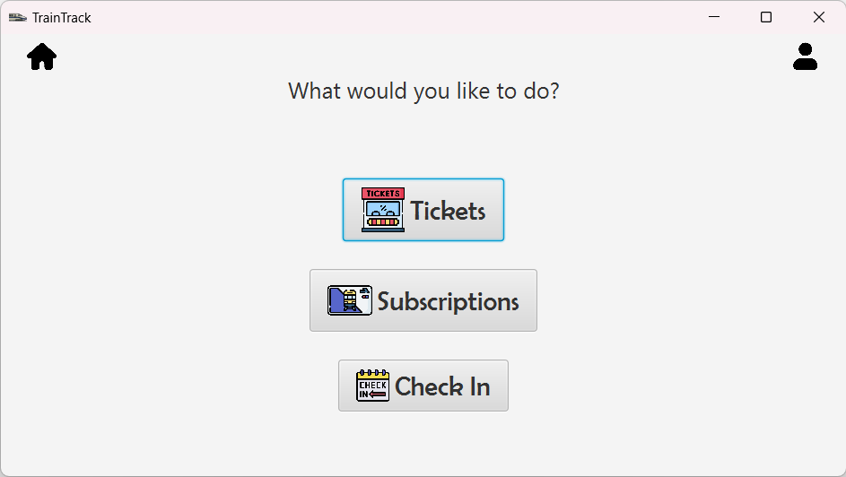
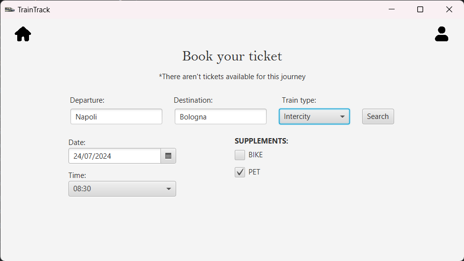

# TrainTrack

## Introduzione
Questo progetto è un sistema di gestione dei treni chiamato "TrainTrack". L'applicazione permette di tenere traccia dei treni, percorsi, stazioni, macchinisti, prenotazioni dei biglietti e abbonamenti.

## Configurazione del Progetto
1. Importa il progetto come "gradle project" nel tuo IDE.
2. Configura le credenziali del database MySQL nella classe `DBConnection.java` situata nel package `db`.

## Creazione del Database
1. In MySQL, crea il database traintrack utilizzando le istruzioni SQL presenti nel file traintrack.sql situato nel package sql.
2. Popola il database con i dati essenziali utilizzando il file fillQueries.sql presente nello stesso package.

## Esecuzione dell'applicazione
1. Naviga fino alla classe principale contenente il metodo main situata nel package `src/main/java/application/Main.java`.
2. Esegui la classe principale per avviare l'applicazione.

### Applicazione

#### Schermata Principale

Questa schermata mostra la pagina principale dell'applicazione dove gli utenti possono visualizzare una panoramica dei servizi offerti.

#### Schermata di Login

Questa è la schermata di accesso dove gli utenti possono inserire le proprie credenziali per accedere al sistema.

#### Schermata di Registrazione

Questa schermata permette ai nuovi utenti di registrarsi al sistema creando un nuovo account.

#### Schermata dei Servizi

Questa schermata fornisce una panoramica dei vari servizi disponibili, come la visualizzazione degli orari dei treni e la gestione delle prenotazioni.

#### Schermata dei Biglietti

Questa schermata consente agli utenti di visualizzare e gestire i propri biglietti, compresa la prenotazione e l'annullamento dei biglietti.
